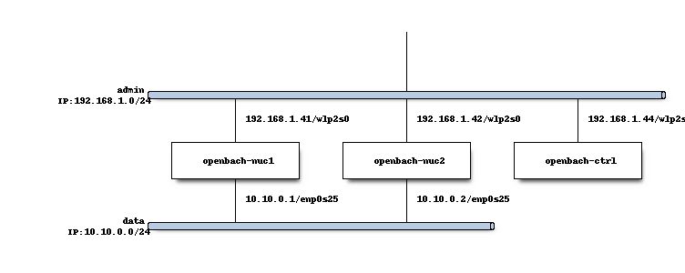

# OpenBACH Example : install, set up and run tests using OpenBACH

This project provides the scripts to install, to set up and run tests using OpenBACH.

This project does not prevent the reader from looking at [OpenBACH installation manual](https://wiki.net4sat.org/doku.php?id=openbach:manuals:2.x:installation_manual:index).
(in particular for the requirements on each target and instal machines)

## Usage

By cloning the current repository, the user can:

1. run the `00-install.sh` script to install OpenBACH
1. run the `10-setup-project.sh` script to set up an OpenBACH project

Based on this, the user can either use the auditorium scripts, the IHM or the provided scripts `20-run.sh` to build and run scenarios.

## Installation details

If you encounter python-version related errors, we recommend you to either: 

* On the installation machine
  * Use virtual env
  * Update your paths on the installation machine, e.g. 
    * `vim ~/.bashrc`
      * add `export PYTHONPATH="$PYTHONPATH:/home/kuhnn/Desktop/openbach-extra/apis"`
      * add `export PATH="$PATH:/home/kuhnn/.local/bin"`
    * source ~/.bashrc 
* On the target machines
  * Update the PYTHONPATH to use the correct version of python, e.g.
    * `vim ~/.bashrc`
      * add `export PYTHONPATH="$PYTHONPATH:/usr/bin/python3"`
    * source ~/.bashrc 

Three NUCs are exploited and the network architecture is showed below.
Each NUC exploits `Ubuntu 16.04.07 LTS` with the username `kuhnn`

* The IP addresses on the admin network are fixed through DHCP rules on the Wi-Fi router.
* The NUC are interconnected through a switch; the IP addresses are fix through the following: 
  * ssh 192.168.1.41 (or 42)
  * sudo vim /etc/network/interfaces.d/*
    * add the following: 
      * source /etc/network/interfaces.d/*
  * sudo vim /etc/network/interfaces.d/interface-data-enp0s25
    * add the following:
      * auto enp0s25 
      * iface enp0s25 inet static
      * address 10.10.0.1 (or 2)
      * netmask 255.255.255.0
  * reboot
 
